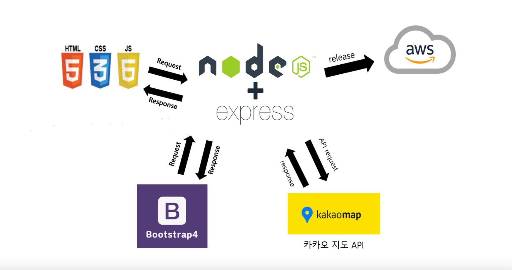

[] (https://nodejs.org/ko/)
[] (https://expressjs.com/ko/)

# 지도 API를 이용한 중간 지점 찾아주기 서비스(Find the center with kakaomap)

## About the project

- 웹 사이트 기반으로 개발되었으며 사이트 내에서 중점을 정하기 위한 여러 타겟 장소들을 입력받습니다.
- 결과 화면에서 중간 지점을 지도에 나타내며 주변 시설에 대한 정보를 얻을 수 있습니다.

### Project Architecture



### Built with

- [Node.js](https://nodejs.org/ko/)
- [Express](https://expressjs.com/ko/)

## Getting Started

### Prerequisites

- If you use your own domain, need domain address and you should set domain constraints for the port number.
- If you use your own domain, need to create kakao account and follow few steps.
    - Visit the site : [**https://developers.kakao.com/**](https://developers.kakao.com/)
    - In menu “My Application”, Add new application and go to settings.
    - In menu “App Settings - Platform”, you must input your own domain at the tab “Web”.
    - In menu “App Settings - Summary”, copy JavaScript key and paste to stated line from “map.html” and “result.html”.

### Installation

- Clone the repository

```bash
git clone [http://khuhub.khu.ac.kr/2018102160/find-the-center.git](http://khuhub.khu.ac.kr/2018102160/find-the-center.git)
```

- Install npm packages

```bash
npm install
```

## **Contributing**

어떠한 기여도 환영입니다. 다음의 절차를 지켜주시면 감사하겠습니다!

1. Fork the Project
2. Create your Feature Branch (git checkout -b feature/name)
3. Commit our changes (git commit -m “Add feature something”)
4. Push to Branch (git push origin feature/name)
5. Open a Pull Request

## **License**

MIT 라이센스 아래 사용 가능합니다. LICENSE.txt 를 통해 자세한 정보를 확인하세요.

## **Contact**

- 길지운 : wldns2577@khu.ac.kr
- 김재현 : codmo12@khu.ac.kr
- 안종학 : whdgkr3567@khu.ac.kr